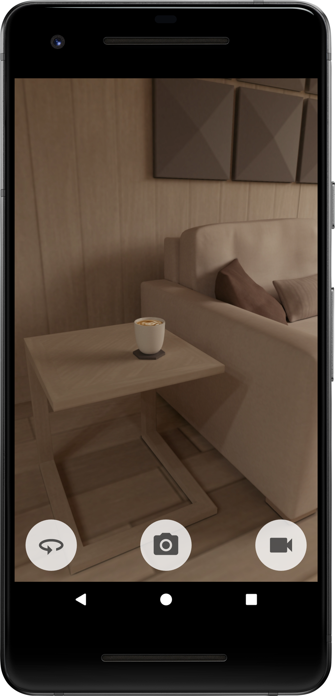
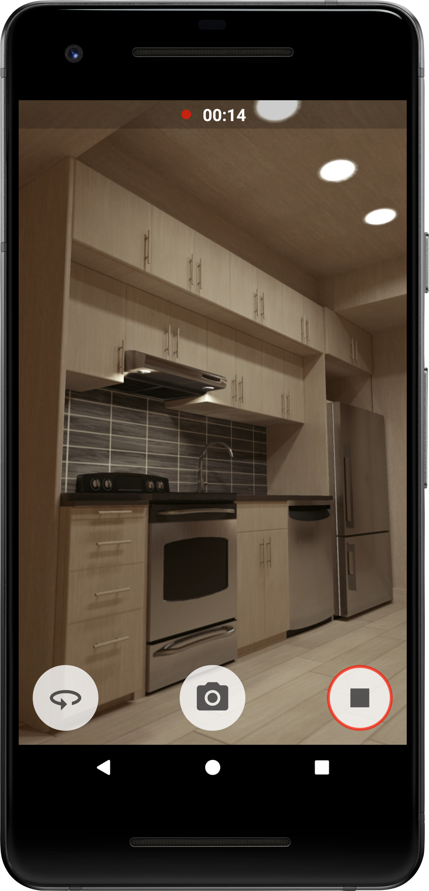

# Camera
CameraApp created in Android Studio

In CameraApp are used CameraX dependencies.

There are three buttons: to switch front and back cameras, to take photo and to record video.

While recording videos screen orientation is set constant to protect activity from reloading in case of phone rotation.

When video is not recording screen orientation is back to unspecified.

Taken photos and videos are saved in phone Gallery.

  
